# wanted-pre-onboarding-backend

## 작성자 : 오동혁

## 📔 Api 명세서

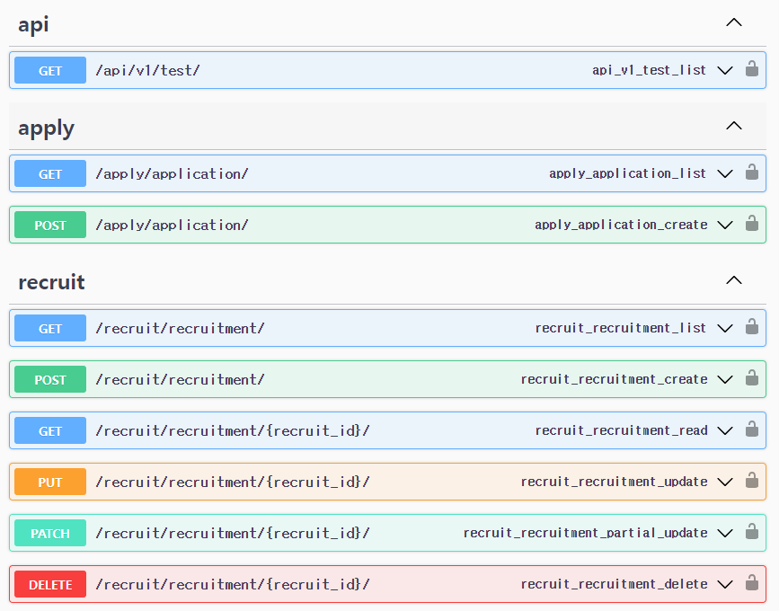

-  서버를 실행한 후 'http://127.0.0.1:8000/swagger/' url로 접근 하면 해당 api들을 볼 수 있습니다.

## 📊 요구 사항 분석 및 구현 과정

### 1. 채용공고를 등록합니다.
  - 아래와 같이 http://127.0.0.1:8000/recruit/recruitment/ 경로로 post 요청을 하면 데이터가 db에 저장되고 두번째 이미지 처럼 리스트에 추가 됩니다.
  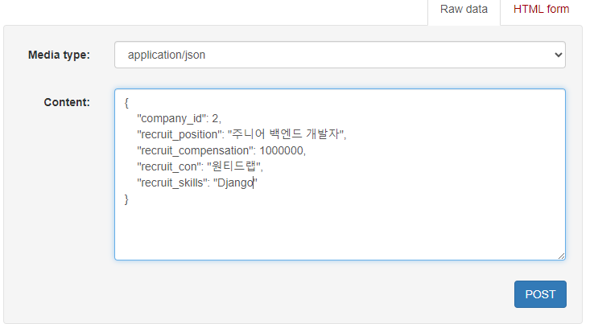
  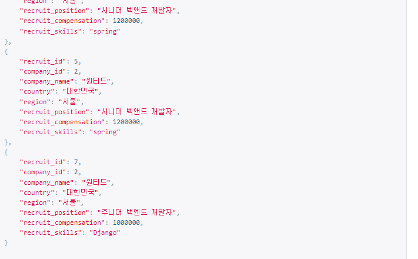

### 2. 채용공고를 수정합니다.
  - 아래 이미지와 같이  http://127.0.0.1:8000/recruit/recruitment/{채용공고_id} 경로로 put, patch와 같은 요청을 보내면 두번째 이미지처럼 상세 내용이 수정 됩니다.
  
  [변경전]

  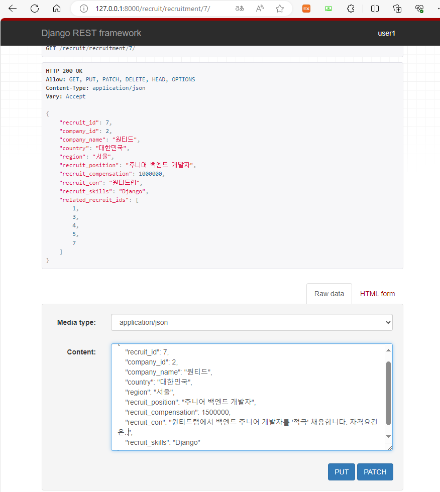

  [변경후]

  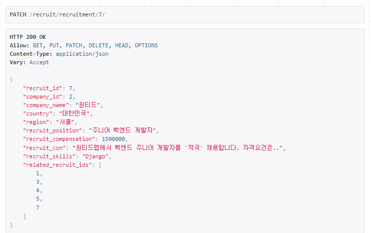

  ### 3. 채용공고를 삭제합니다.

  - 아래와 같이 delete를 눌러 http://127.0.0.1:8000/recruit/recruitment/{채용공고_id} 경로로 delete 요청을 보내면 이후 목록에 채용공고 7이 없는것을 확인 할 수 있습니다.

  [변경전]

  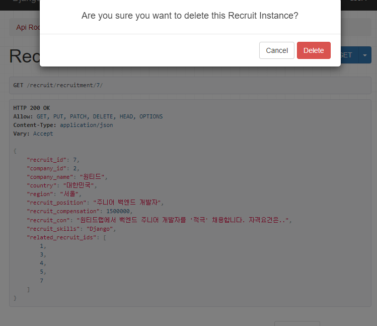

  [변경후]
  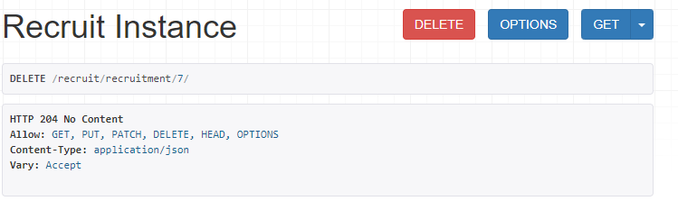

  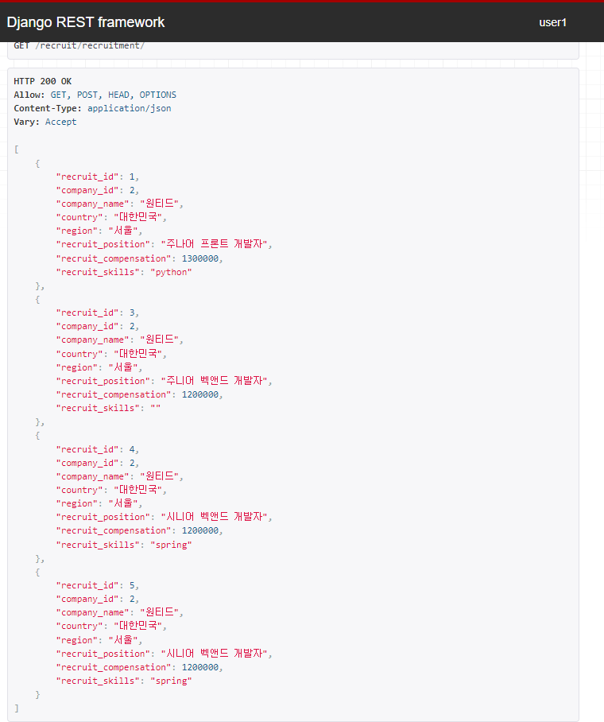

  ### 4. 채용공고 목록을 가져옵니다
  #### 4-1. 사용자는 채용공고 목록을 아래와 같이 확인 할 수 있습니다.

  
    
  #### 4-2.채용공고 검색기능 구현

  - 아래와 같이 filter에서 검색할 문자를 입력하고 GET /recruit/recruitment/?search=Django으로 요청하면 'company_id__company_name', 'company_id__region', 'recruit_position', 'recruit_con', 'recruit_skills' 중 해당 문자가 있으면 그 채용공고를 리스트로 출력해줍니다.

  [검색전]

  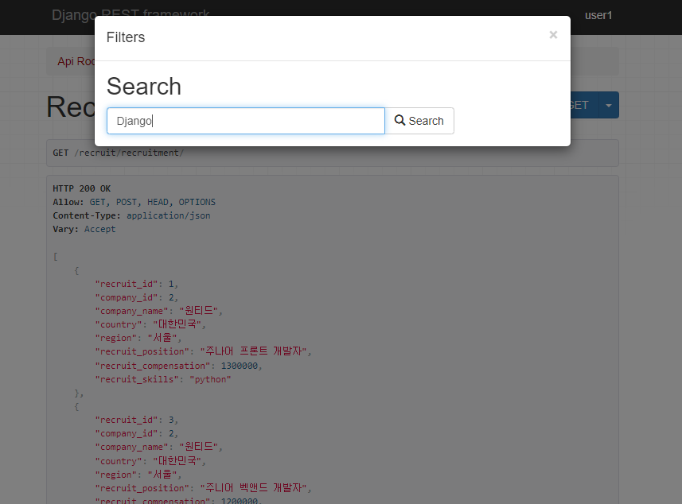

  [검색후]

  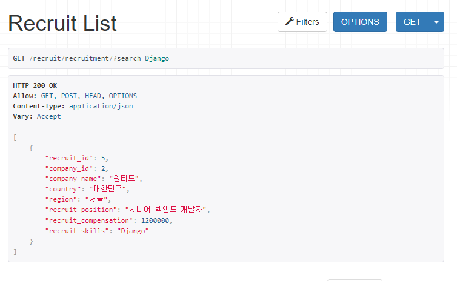

  ### 5. 채용 상세 페이지를 가져옵니다.
  -  http://127.0.0.1:8000/recruit/recruitment/{채용공고_id} 으로 새로고침하거나 get요청을하면 다음과 같이 볼수 있습니다.

  - 채용목록에는 없는 'recruit_con' 채용내용이 추가적으로 담겨 있으며 해당 회사가 올린 다른 채용공고_id가 'related_recruit_ids' 리스트에 포함되어 응답됩니다

  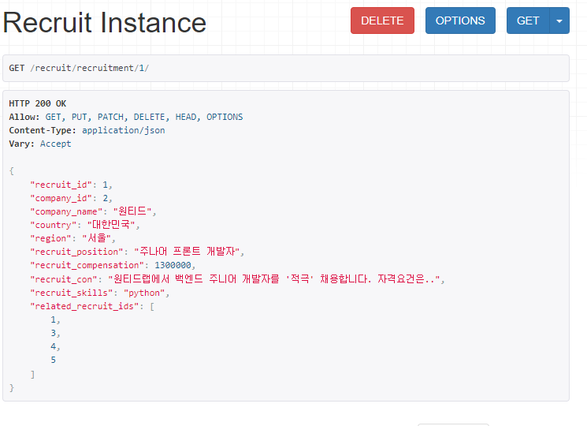

  ### 6. 사용자는 채용공고에 지원합니다
  - 사용자가 POST '/apply/application/'를 통해
    요청을 보내면 지원이 되고 한 사람당 한 지원만 할 수 있도록 ONETOONE으로 설정하여 세번째 이미지 처럼 이미 지원 했다고 알려줍니다.

  [지원전]

  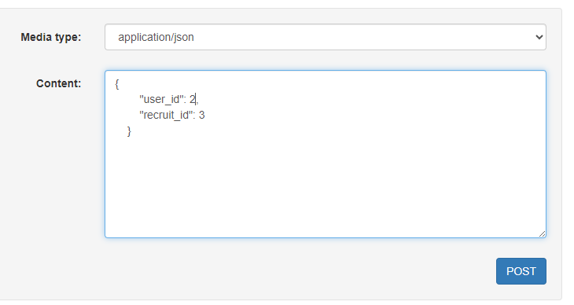
  
  [지원후]

  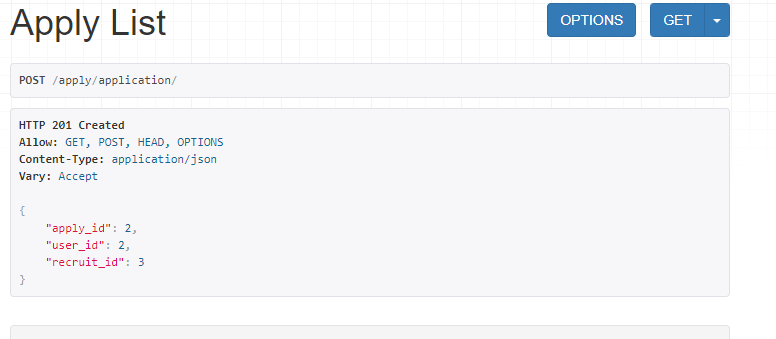

  [지원 불가]

  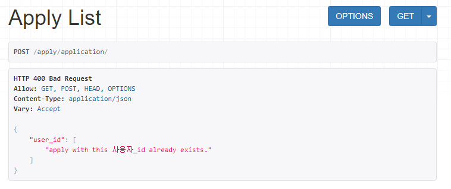
## 📚 stacks

<div> 
  <p align="center">
    
   
  
</p>

</div>


## ⚙️ Environment and installation method
For building and running the application you need:
- vscode (v.1.78.2)
- conda 가상환경을 사용하시는 것을 권장 드립니다.
  - conda create -n (가상환경 이름) python=3.10
  - conda activate (가상환경 이름)
- python 3.10.11
- django 4.2.6
- pytest-django 4.5.2
- drf-yasg 1.17.7 (swagger 사용)

'''
- conda 환경 설정 후 requirements
$ pip install -r requirements.txt
'''

```
- 데이터 베이스는 local mysql과 연결
  table_name=wanted
  - mysql connection 생성 및 스키마의 table 생성
- 이후, python manage.py makemigrations
- python manage.py migrate를 해주시면 db가 생성됩니다.
 ```
